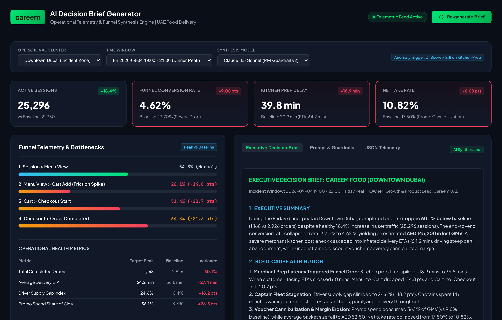

# Careem Food: AI Decision Brief Generator

Autonomous operational telemetry analysis and executive decision brief synthesis engine for Careem Food (Dubai, UAE).

**Candidate:** Meldi Hafizh Sayoko  
**Submission Focus:** Careem Optional AI Challenge (Challenge 1: Decision Brief Generator)  
**Role:** Product Manager / Growth Manager, Careem UAE  

---

## 100-Word Summary: Idea & Approach

Careem Food Decision Brief Generator converts hourly multi-zone delivery telemetry into executive-ready business briefs. The pipeline ingests funnel data, flags statistical outliers across kitchen prep latency, driver supply, and basket sizes, and prompts an LLM with strict product management guardrails. Rather than generating descriptive observations, the system isolates root causes across operational friction and pricing mechanics. It then delivers three prioritized, functional levers: dynamic delivery radius throttling for congested kitchens, minimum order value guardrails on peak vouchers to prevent margin leakage, and in-app scheduled delivery incentives to smooth peak demand while protecting unit economics.

---

## Live Prototype & Telemetry Dashboard



Open `index.html` in any modern web browser to interact with the console, inspect funnel conversion rates across Dubai zones, and generate real-time AI decision briefs.

---

## Repository Structure

```
.
├── README.md                                 # Overview and documentation
├── Careem_PM_AI_Challenge_Meldi_Hafizh.pdf   # 2-page compiled vector PDF submission
├── careem_food_dubai_hourly.csv              # Synthetic telemetry dataset (900 hourly observations)
├── brief_engine.py                           # Telemetry processing & prompt synthesis engine
├── generate_dataset.py                       # Telemetry dataset generator
├── index.html / dashboard.html               # Standalone interactive dashboard console
├── Careem_Decision_Brief_Generator.ipynb     # 1-click Google Colab / Jupyter notebook
├── sample_decision_brief.md                  # Generated decision brief for Downtown Dubai peak
└── assets/                                   # High-resolution screenshots and visual assets
```

---

## Telemetry Dataset Schema

The dataset (`careem_food_dubai_hourly.csv`) covers 36 peak hours across 5 major Dubai delivery zones: **Downtown Dubai**, **Dubai Marina**, **Business Bay**, **JLT**, and **Deira**.

| Column | Description |
| :--- | :--- |
| `timestamp` | ISO hourly timestamp (e.g. 2026-09-04 19:00) |
| `zone` | Dubai operational cluster |
| `cuisine_category` | Merchant cuisine segment |
| `sessions` | Active user sessions in cluster |
| `listing_views` | Restaurant listing page impressions |
| `menu_views` | Restaurant menu page views |
| `cart_adds` | Basket additions |
| `checkout_starts` | Checkout review screen views |
| `orders_completed` | Completed and delivered orders |
| `gmv_aed` | Gross Merchandise Value (AED) |
| `avg_basket_size_aed` | Average basket size / AOV (AED) |
| `promo_spend_aed` | Co-funded promo and discount voucher spend |
| `net_take_rate_pct` | Net commission take rate percentage |
| `kitchen_prep_time_min` | Order accepted to food ready latency (mins) |
| `avg_delivery_time_min` | Customer-facing total delivery time (mins) |
| `driver_supply_gap_pct` | Captain fleet deficit percentage vs demand |

---

## Case Study Scenario: Friday Dinner Peak (Downtown Dubai)

During the Friday dinner rush (19:00 to 22:00), the engine detects an operational crisis in Downtown Dubai:

1. **Traffic Surge vs Conversion Drop:** Sessions grew +18.4% to 25,296, but completed orders collapsed -60.1% (1,168 vs 2,926 baseline).
2. **Operational Bottleneck:** Kitchen prep latency spiked +18.9 mins to 39.8 mins. As customer ETAs crossed 60 mins, Cart-to-Checkout conversion dropped by -20.7 pts.
3. **Margin Dilution:** Heavy voucher usage diluted average basket size down to AED 52.80 while promo spend surged to 36.1% of GMV, collapsing net take rate from 17.50% to 10.82%.

### Three Prioritized Levers

- **Operational Dispatch:** Dynamic delivery radius compression from 7 km to 3.5 km for kitchens with rolling prep times > 30 mins; AED 4 surge bonuses to attract Captains from Business Bay.
- **Commercial Growth:** Raise voucher minimum order value from AED 40 to AED 75 during peak hours to protect basket margins.
- **Product Experience:** In-app kitchen queue transparency badges and 50 Careem Plus reward points for scheduling deliveries +30 minutes post-peak.

---

## Quickstart

### 1. Run Python Decision Brief Engine
```bash
python3 brief_engine.py
```

### 2. Launch Interactive Dashboard
Simply double-click `index.html` or serve via Python:
```bash
python3 -m http.server 8080
```
Open `http://localhost:8080` in your browser.

### 3. Open in Google Colab
Launch `Careem_Decision_Brief_Generator.ipynb` directly in Google Colab or Jupyter Notebook for cloud execution.
